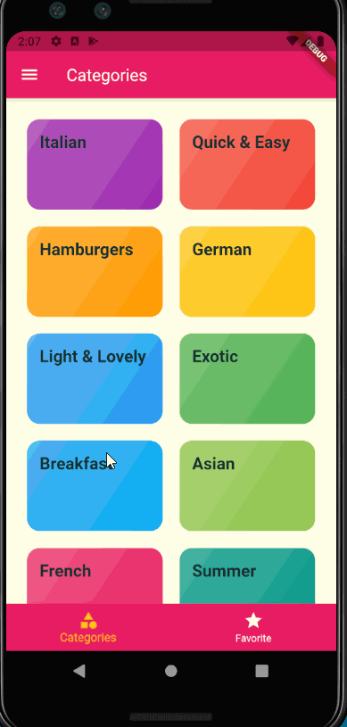

# Meals App

An app where you can have your favorite receipes, and you can access the receips.

## Info

This project is build with flutter...

In this project you are able to see different categories of meals, and in each categories there is different receips for the meals.

- You can browse through all meal categories
- You can select a category and see all meals that belong to that category
- You can open a detail view of the meals
- You can favorite and un-favorite any meal
- You have a screen to see your favorite meals
- You can set filters to filter different kinds of meals

## Video Walkthrough

Here's a walkthrough of implemented user stories:

GIF created with [LiceCap](http://www.cockos.com/licecap/). 
